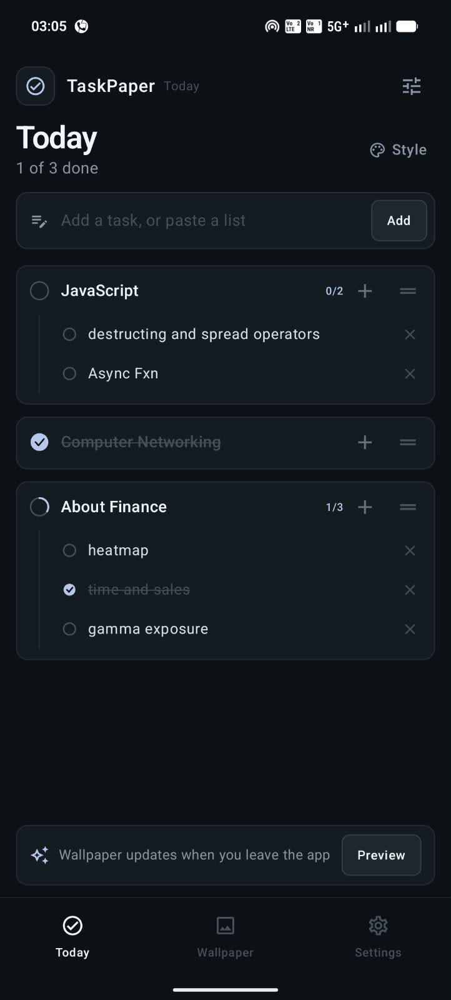
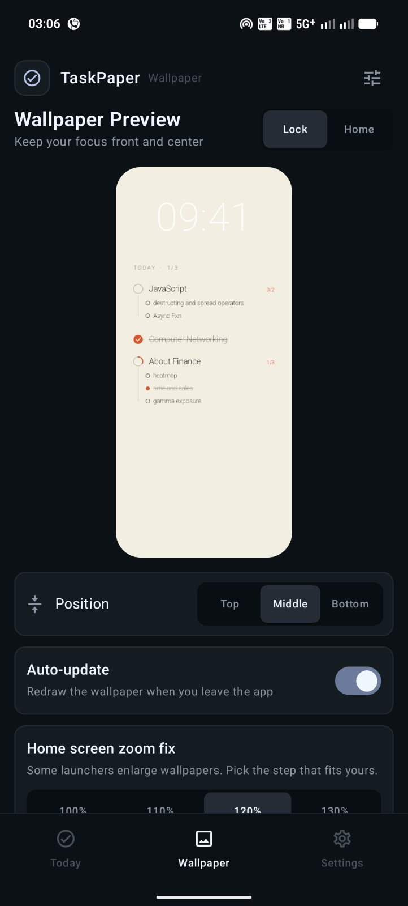
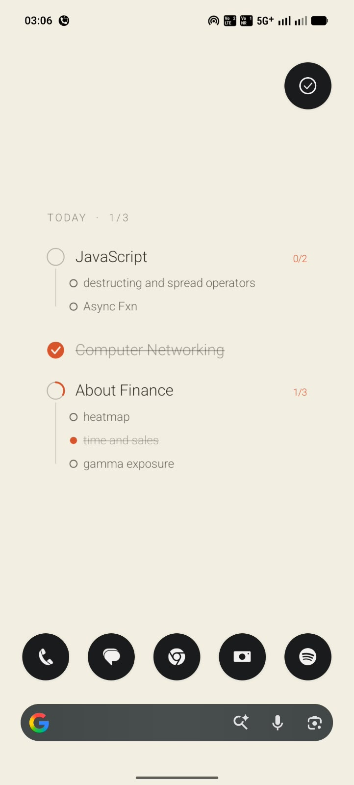

# TaskPaper

A minimal Android to-do app that turns your daily tasks into your phone wallpaper. Tick a task in the app and the wallpaper redraws with that task crossed out, so your plan is always in front of you on the lock screen and home screen.

Built with Kotlin and Jetpack Compose.

## Screenshots

   

## Features

- **Tasks and subtasks.** Add a task, then break it into subtasks. A progress ring fills as subtasks are completed, and the task ticks itself when the last one is done.
- **Wallpaper rendered from your list.** Completed tasks are crossed out or faded, and the layout adapts to the number and length of tasks.
- **Lock screen, home screen, or both.** Choose where the wallpaper is applied.
- **10 themes.** Six solid themes and four gradient themes with a fine film grain.
- **Layout controls.** Vertical position (top, middle, bottom), density, how completed tasks look, and three typefaces.
- **Live preview.** The in-app preview uses the same renderer as the real wallpaper.
- **Quick entry.** Press Enter to add a task, or paste a multi-line list to add several at once.
- **Gestures.** Swipe right to tick, swipe left to delete (with undo), and drag the handle to reorder.
- **Daily reset.** Around midnight, finished tasks clear and unfinished ones carry over.
- **Works offline.** No internet permission, no account, and all data stays on the device.

## How it works

1. Tasks and subtasks are stored locally in a Room (SQLite) database.
2. When you leave the app, `WallpaperRenderer` draws the list onto a bitmap with Android's `Canvas`. It lays out the text first, then shrinks and wraps it until everything fits.
3. `WallpaperManager.setBitmap()` applies the bitmap to the lock screen, home screen, or both.
4. A WorkManager job handles the daily reset.

The wallpaper is a rendered image, so it updates when you leave the app (or tap **Apply wallpaper now**) rather than live.

## Tech stack

- Kotlin
- Jetpack Compose and Material 3
- Room
- WorkManager
- Android `Canvas` and `WallpaperManager`

Minimum Android version: 8.0 (API 26).

## Build and run

1. Install [Android Studio](https://developer.android.com/studio).
2. Clone the repository and open the folder in Android Studio:
   ```
   git clone https://github.com/YOUR-USERNAME/YOUR-REPO-NAME.git
   ```
3. Wait for the Gradle sync to finish.
4. Connect a phone with USB debugging enabled (or start an emulator) and press **Run**.

## Project structure

```
app/src/main/java/com/nj/taskwall/
  MainActivity.kt        Entry point, navigation and theme
  TodayScreen.kt         Task list, subtasks, swipe and drag
  WallpaperScreen.kt     Phone preview and apply controls
  SettingsScreen.kt      Themes, layout, typography options
  Components.kt          Shared UI pieces and colors
  WallpaperRenderer.kt   Draws the wallpaper bitmap
  TaskViewModel.kt       State and wallpaper update job
  Data.kt                Room entities, DAO and database
  Themes.kt              Theme definitions
  Settings.kt            Saved settings
  DailyReset.kt          Midnight reset worker
```

## Known limitations

- Some launchers enlarge the home-screen wallpaper. The **Home screen zoom fix** setting compensates for this, and the default is tuned to one device, so you may need to pick a different step.
- The wallpaper is a still image, so a ticking clock cannot be drawn into it.

## Roadmap

- Clock and "time left today" home-screen widget
- Database migrations and further hardening for a Play Store release

## License

Add a license of your choice (for example MIT) before others reuse this code.
